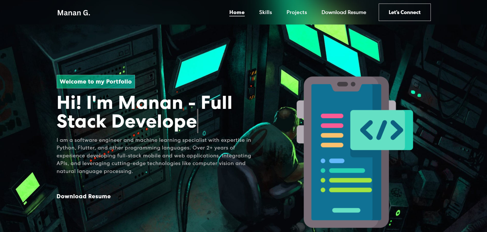
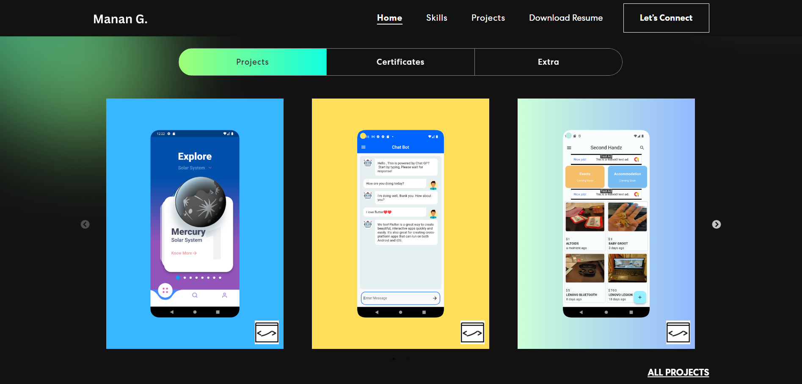
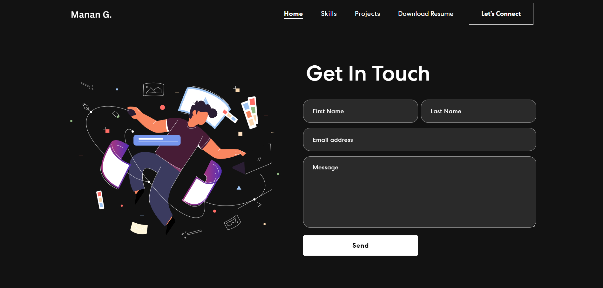

# Personal Portfolio Website in React

## Live Preview
You can preview the project live [here](https://fluttersolutions.in/).

Description
This repository is regarding my portfolio website depicting my portfolio built using React and BootStrap. It is currently hosted live. I have also attached screenshots if you are unable to preview it.

## Screenshots





## Built using:

- Front-end library: React
- CSS framework: React-bootstrap
- CSS animations library: Animate.css
- EmaiJS for contact form: EmailJS

Path for Resume & Certificates
- public/resumes
- src/assets/Certificates 


## Set-Up EmailJS
[EmailJS Documentation](https://www.emailjs.com/)

- Create a .env file on the top hierarchy and add the below

> REACT_APP_EMAILJS_SERVICEID = "add your key"
> REACT_APP_EMAILJS_TEMPLATEID = "add your templateID"
> REACT_APP_EMAILJS_PUBLICKEY = "add your public key"


##  In the /personal-portfolio, you can run:

1. Install Dependencies

```sh
npm install
```

2. Start the app

```sh
npm start
```

3. Build the app
```sh
npm run build
```
